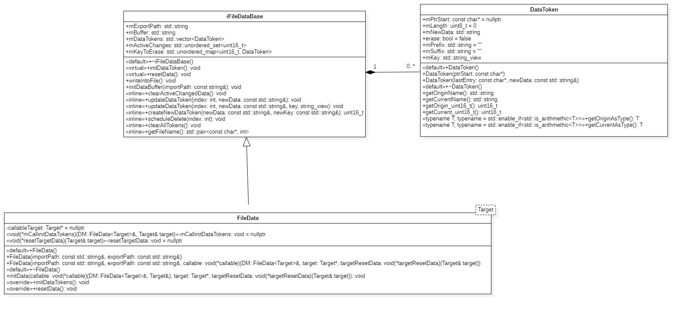
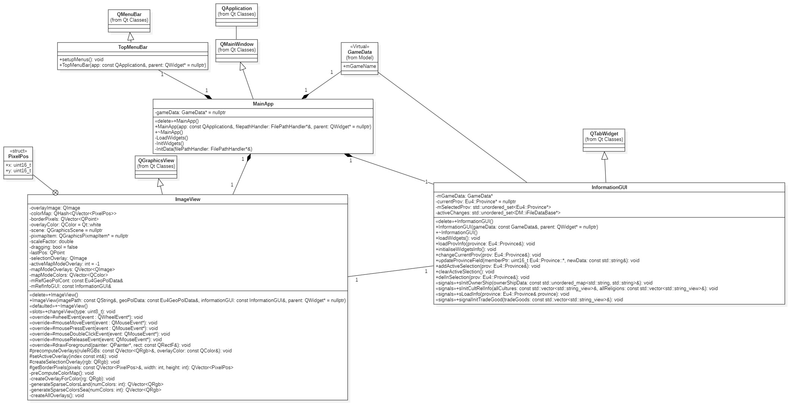
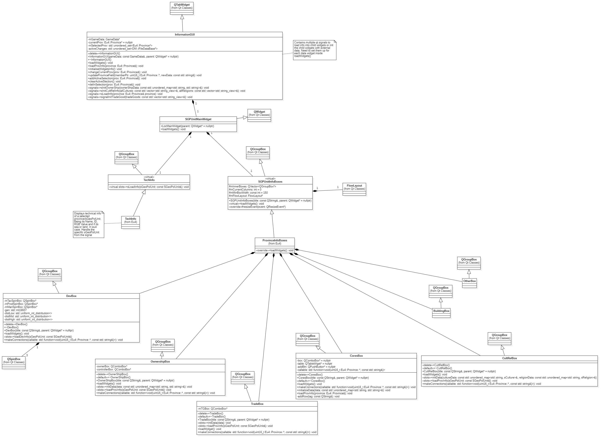
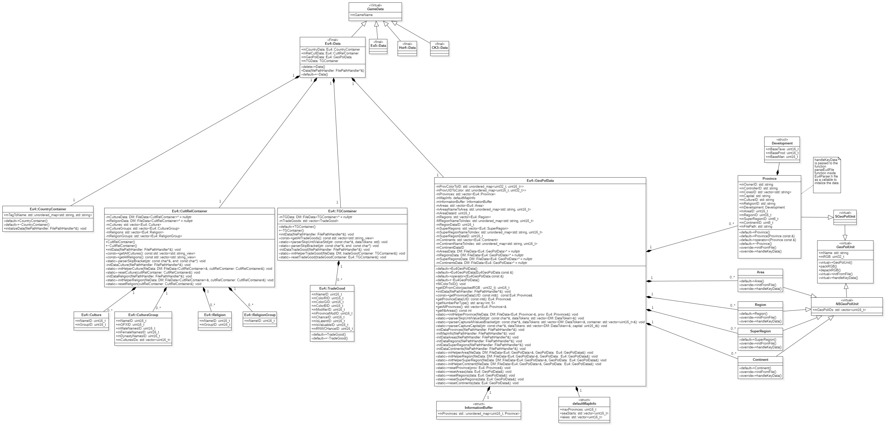

# Polybius Modtools Programmer User Manual

In this manual some specific pipelines and systems will be explained. Please be aware as much as I updated the class diagrams some might not correspond exactly to the actual code espescially in the Qt structure. This document is always subject to change.

## FileManager

The FileManager is the file that contains all the logic concerning data retrieval from a file and containing said data. Three classes are used. FileData, iFileDataBase and DataToken. The idea is to retrieve the data of a file inside a string for ease of access and then have tokens directly pointing towards data inside of the string. These tokens also have another string in case there is a change of data this way it can act as a temporary buffer before saving into a new file which deletes all tokens and create new ones towards the new string from the new file.



### iFileDataBase

This class contains the data and most methods used outside this system to interract with the data. It also contains the methods to read and write the into the files.

### FileData

This class is a child of `iFileDataBase` and also a template class. The template is used for two things. One to store a pointer to a target which would contain ID's representing the index of a `DataToken` inside this class. The other to store a callable passing itself with the target class. This way the system can interract with any other class as long as two other things are given to it. These are the callables to initialize the DataTokens and one to reset its data.

### DataToken

This class is used to contain data for one specific value. Mostly a pointer into the buffer of the string containing the file and an uint_8 representing its length. It also has various variables that helps for writing back into the file and retrieving data.

### Use Case Exemple

Below will be a little exemple on how to use it.

## Qt UI/View structure

There is two distinct parts the `StartupBox` and the `MainApp`.

### StartupBox

When starting the application this launcher will start before the main application. It has a few roles. Selecting the game and ensuring the game folder have the required file and directories. Setting up the import path and export path for the main application. Eventually it will also be where loading mods will be setup too. It will also contain various loading options(ex:load base game for culture but load mod for religion).

### MainApp

This is the main QT class and controller of the programm. It receives the `FilePathHandler*&` that was previously setup in the `StartupBox` to initialize data and contain a pointer to it. It then as the responsability to create `TopMenuBar`, `InformationGUI`, `ImageView` and setting the layout. It also connects the topbar to the imageview through QT signals.



#### ImageView

This class is responsible for displaying the province.bmp image file and handling all manipulation to it. It's also responsible for overlay images and province selection. When clicking on a province it first retrieve the color at the pixel position. This color is then used to retrieve the UID of the corresponding province. Then by using this id retrieve a reference to the province which is then sent to`InformationGUI::loadProvInfo(Eu4::Province& province)` which sends a signal to all its child in the tree to update their values with the province sent.

#### InformationGUI

This class is responsible for displaying all the other QT widgets used to represent game data visually, containing the active selection, setting up the QT signal/slot connections between various methods for loading information to the widget and initializing certain widgets, most of all it contains the method which updates a province field. This method(`updateProvinceField(uint16_t Eu4::Province::* memberPtr, const std::string& newData)`) is passed as a callable to each specific box when calling `loadWidgets()`. When the user updates a value in a box it calls this method with a member pointer that corresponds to the target variable to change.



## Model Structure


For Eu4, each container stored in the GameData child class has these responsabilities :

1. Containing one or multiple ``DM::FileData<>*`` for each file used by the class.
2. Containing variables that represent the index of the corresponding ``DataToken`` inside their `DM::FileData<>*`. Can be either directly or trough other class contained inside the container.
3. For each type of data inside the container class define one method to initialize data which use the `FilePathHandler` to get the path to the files and then create a new FileData and call its method to retrieve the data and populate the variables. This method takes two callables and a pointer to a target which is usually the container itself.
    - The First callable is always the helper callable(ex: initHelperCulture). It's a static method and it takes two parameter. A reference to a DM::FileData and a reference to the corresponding container. It's there that the exact way to retrieve data from a buffer is defined. Usually by pointer arithmethic which then creates the DataTokens and assign the ID to the variables of the container.
    - The Second callable is another static method and is used to reset the data if needed. Currently it's only used in GeoPolData. It needs to be defined and passed but it should be empty if not used.
4. Various methods for data access.

## Adding A New Widget to the province tab

1. Determine which Qt widget to use and a basic layout you want.
2. Create a class that inherits from QGroupBox. For simply adding without linking any data update two methods are needed.
    - `LoadWidget()` : All the sub-widgets and layout elements are defined there. It's then usually called once in the constructor of the class.
    - `initializeData()` : only needed when you need some external data to initialize a widget like for QComBoxes. The parameters are variable depending on the needs of the widget. It's a qt slot method. Declared like so (exemple from TradeBox.h):

        ```cpp
        public slots:
            void initializeData(const std::vector<std::string_view>& tradeGoods)
        ```

    - Extra Variables : sometimes for ease of use keep pointers to the Qt widgets. No need to handle their lifetime as Qt does it for us there.
3. If `initializeData()` was used then you need to link that slot with a signal. This is done inside `InformationGUI::loadWidgets()`. Create the signal inside the ``InformationGUI`` class, add it to its method `initialiseWidgetInfo()` and then simply add it after the other declaration like so :

    ```cpp
    QObject::connect(this, &InformationGUI::signalInitTradeGood,provinceTab->findChild<TradeBox*>(), &TradeBox::initializeData);
    ```

4. Inside `LocInfoBoxes` constructor create and add the new widget to the `flowLayout` variable.

## Update your new widget to update data

1. Inside your new widget class. Create two methods.

    - ``void makeConnections(std::function<void(uint16_t Eu4::Province::*, const std::string&)> callable);`` :
        - For this method you want to connect the qt signal of one or multiple child widget. For exemple with TradeBox and its QComboBox :

        ```cpp
        void TradeBox::makeConnections(std::function<void(uint16_t Eu4::Province::*, const std::string&)> callable)
        {
            connect(mTGBox, &QComboBox::activated,
                this,
                [this, callable](int index) {
                    QString text = mTGBox->itemText(index);
                    QByteArray data = text.toUtf8();
                    callable(&Eu4::Province::mTradeGood, std::string(data.constData(), data.size()));
                });
        }
        ```

        - Notice what we pass for the first parameter. Since the associated value for the trade data inside a province is at a specific variable we then use a member pointer to the corresponding variable that way any box kind of subscribes to only one update method centralizing the flow.

    - ``void loadProvInfo(Eu4::Province& province);`` :
        - For this method simply use the reference to populate the widget with new data.
        - Exemple :

            ```cpp
            void TradeBox::loadProvInfo(Eu4::Province& province)
            {
                if (province.mTradeGood != UINT16_MAX) {
                    int index = mTGBox->findText(province.mFileData->mDataTokens[province.mTradeGood].getCurrentName().c_str());
                    mTGBox->setCurrentIndex(index);
                }
                else {
                    mTGBox->setCurrentIndex(-1);
                }
            }
            ```

        - Notice the condition where it only select a field if the variable is not the max uint16_t value or else it fallsback to a default index. When the province is initialized all its values are set to this number it indicates no values where found for this field inside a province history file.
2. Inside `InformationGUI::loadWidgets()` after the creation of the updater variable notice a block of similar code. Add the same line but change the class of the widget to the one you created.
    - Exemple of the whole block :

    ```cpp
    auto updater = [this](uint16_t Eu4::Province::* memberPtr, const std::string& newData) {
		updateProvinceField(memberPtr, newData);
		};

	provinceTab->findChild<CultRelBox*>()->makeConnections(updater);
	provinceTab->findChild<OwnershipBox*>()->makeConnections(updater);
	provinceTab->findChild<DevBox*>()->makeConnections(updater);
	provinceTab->findChild<CoresBox*>()->makeConnections(updater);
	provinceTab->findChild<TradeBox*>()->makeConnections(updater);
    ```
