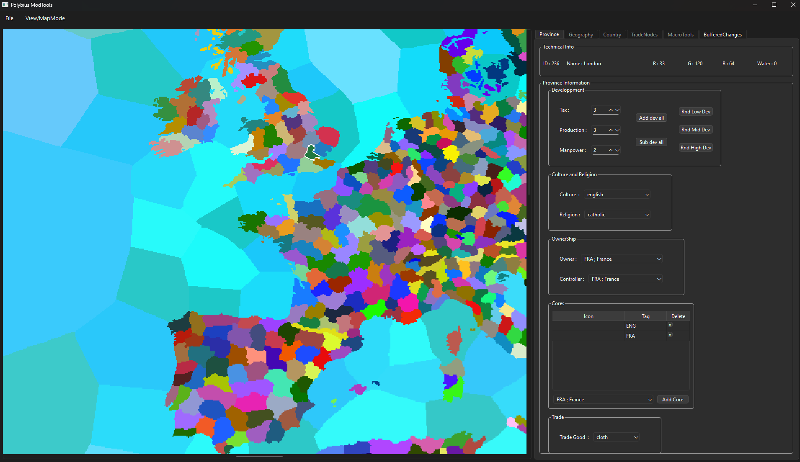
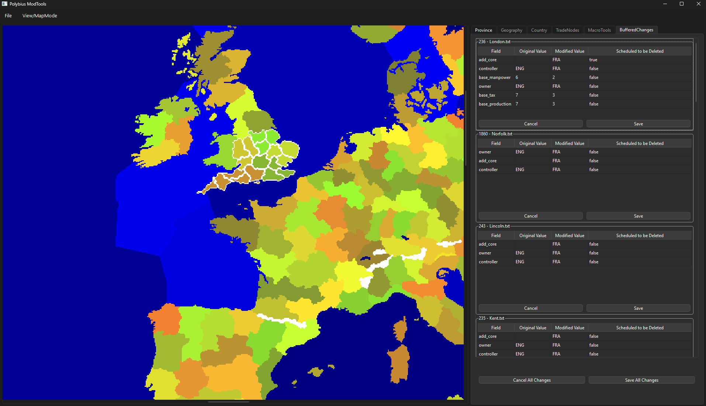

# PolybiusTools

An open-source modding tool for Paradox games with a primary focus on Europa Universalis IV. It is written in C++(C++20) using Qt 6 for its GUI, emphasizing performance and intuitive control scheme.

---

## Features

- Interactive province selection directly from the Europa Universalis IV map
- Multiple visual overlays for geographic and political data : provinces, areas, regions, super-regions, continents
- GUI-based exploration and editing of province data: development, culture, religion, ownership, cores, and trade goods
- Batch selection and modification of multiple provinces
- Change tracking with per-file and global apply / revert controls

---

## Installation

### For Users

1. Download the latest release ZIP from the [Releases](https://github.com/Arzyel/PolybiusTools/releases) page
2. Extract the Zip to your desired location.
3. Run ``PolybiusTools.exe`

**Note:** All required Qt libraries are included in the release of the package.

### For Developpers

See the [Building](#building) section below to compile from source.

---

## Screenshots

## Documentation

- [User Manual](Documentation/UserManual.md) : manual explaining how to use the application.
- [User Programmer Manual](Documentation/ProgrammerUserManual.md) : manual explaining architecture and some basic implementation. Target audience is for developpers.
- [Current Known Bugs](Documentation/Bugs.md) : Known Bugs.
- [Roadmap](Documentation/RoadMap.md) : Current RoadMap of feature and tasks planned.

---

## Requirements

- Qt 6.9.2 (LGPL build)
- Visual Studio 2022 (C++20)
- CMake 3.25+ or Qt Creator 5.x
- Windows 10/11 (Linux support planned but not yet tested)

---

## Building

### Qt Creator

1. Open `ModTool.pro`.  
2. Select **MSVC 2022**.  
3. Build in **Release mode**.

### Visual Studio

1. Open `.vcxproj` or create a new VS project.
2. Install Qt Visual Studio Tools.
3. Configure **Qt paths**.  
4. Build in **Release mode**.

---

## Running

1. Copy `ModTool.exe` from the Release folder.  
2. Copy required Qt DLLs (release, not debug) from your Qt MSVC installation into the same folder.  
3. Launch `ModTool.exe`.  

**Tip:** Use `windeployqt ModTool.exe` to automatically gather DLLs.

---

## License

### Polybius Tools

The source code of PolybiusTools is licensed under the MIT License. See [LICENSE](LICENSE) for full details.

### Qt Licensing (LGPL v3)

PolybiusTools uses the Qt 6 framework under the terms of the GNU Lesser General Public License v3 (LGPL v3).

- Qt is dynamically linked
- No Qt source code is modified
- No Qt source code is redistributed
- Users may replace the Qt libraries with compatible versions

Qt is © The Qt Company Ltd.  
The full text of the LGPL v3 is provided in [LICENSE_QT](LICENSE_QT).

This project fully complies with the LGPL v3 requirements.

---

## Disclaimer

PolybiusTools is an independant, community-developed project. It is not affiliated with, endorsed by, or sponsored by Paradox Interactive.

Europa Universalis IV and all related trademarks, names and assets are the property of Paradox Interactive.

This tool does not include any proprietary game assets and operates solely on files provided by the user.

---

## Project Status

PolybiusTools is under **active development**. Features, file formats and internal APIs may change between versions.

---

## Contributing

Bug reports, testing feedback and feature suggestions are welcome at all stages of development.

Code contributions are accepted but before the 1.0 release the internal architecture is still evolving. As a result larger or structural changes may be defered or require discussion first.

Once the project reaches version 1.0 broader code contributions will be actively encouraged.

---
